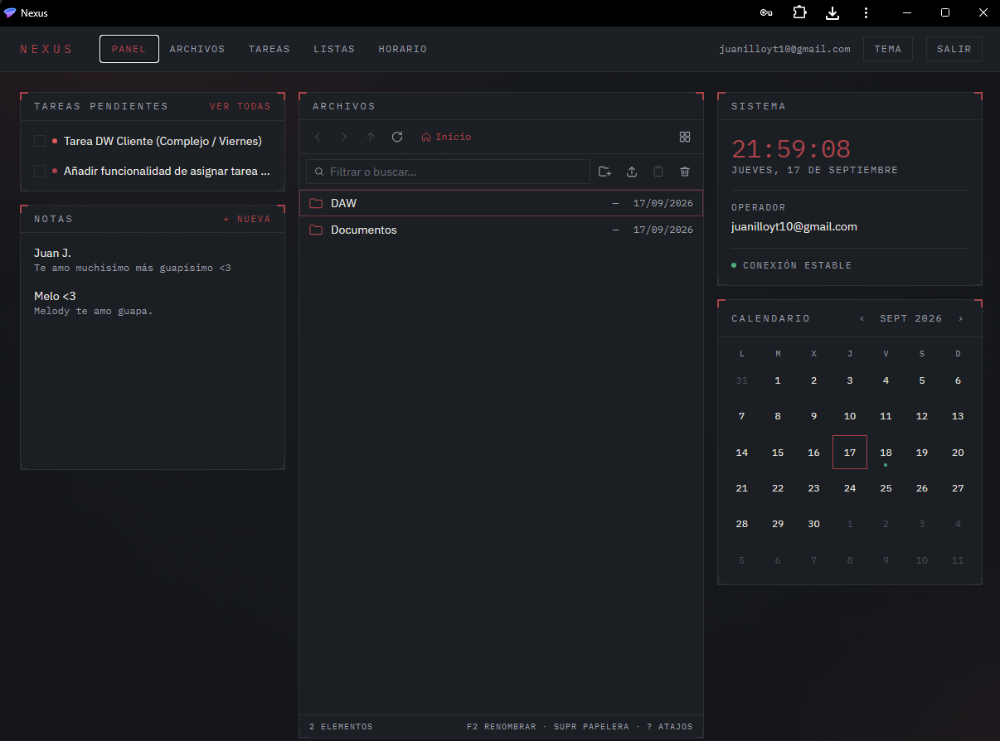
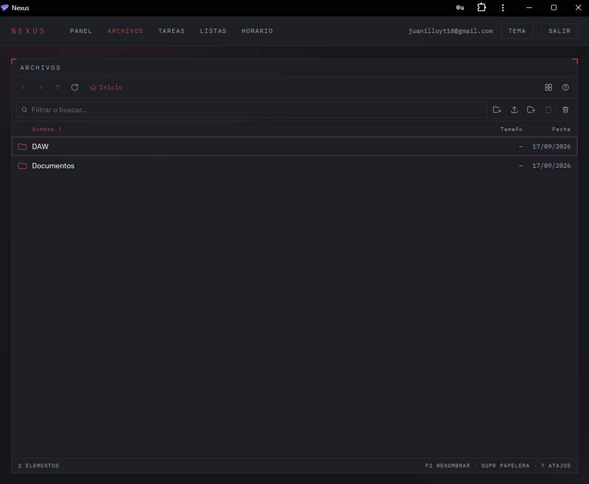
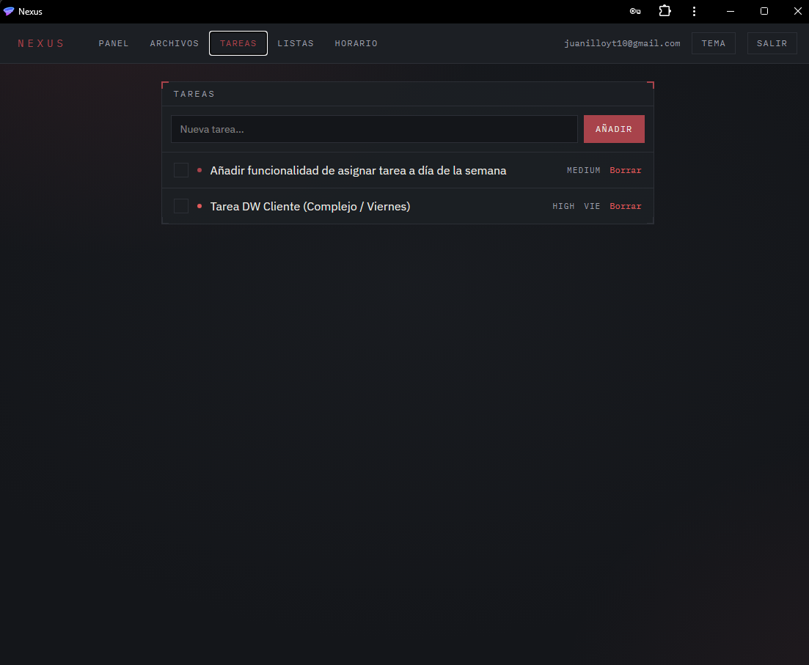
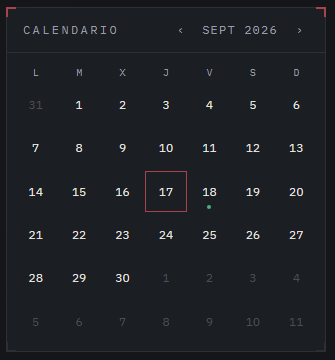
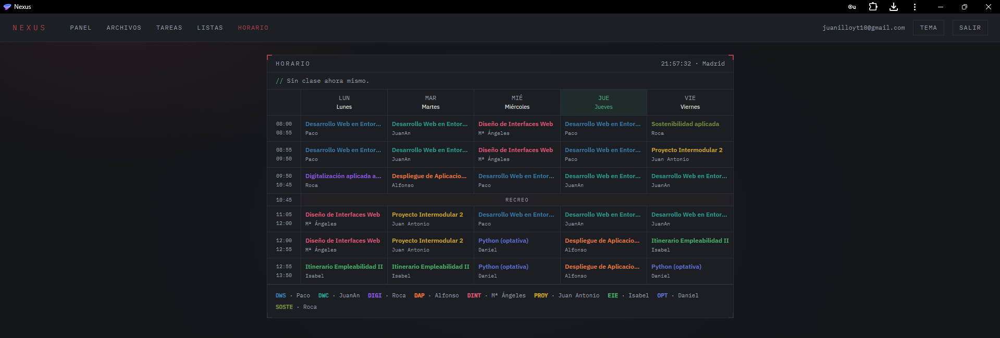

# Nexus

Espacio de trabajo personal self-hosted: gestor de archivos, tareas, notas,
listas diarias y horario de clases, todo en una sola aplicación que corre en un
portátil de casa y se publica a internet por un túnel de Cloudflare.

No es un SaaS ni un proyecto de portfolio. Es una aplicación de uso privado para
dos personas, escrita para aprender Python y FastAPI a fondo, con la idea de que
con el tiempo se convierta en un asistente con acceso controlado a ese contexto
personal (archivos, tareas, notas, calendario).



---

## Qué hace

- **Archivos**: explorador completo con carpetas anidadas, subida y descarga,
  papelera, búsqueda, copiar/mover, arrastrar y soltar desde el escritorio, menú
  contextual, atajos de teclado y vista previa de imágenes, PDF, vídeo, audio y
  texto sin salir de la aplicación.
- **Tareas**: CRUD con prioridad, día de la semana opcional, subtareas tipo
  checklist, papelera con restauración y filtros/ordenación.
- **Notas**: notas de texto con editor en modal.
- **Listas diarias**: listas tipo checklist, sueltas o ancladas a un día del
  calendario, con archivos adjuntos por elemento.
- **Calendario**: vista de mes que junta, para cada día, las asignaturas de ese
  día lectivo, las tareas asignadas a ese día de la semana y las listas.
- **Horario**: horario de clases con reloj en vivo (Europe/Madrid) y resaltado
  de la clase actual.
- **PWA**: instalable desde el navegador, en escritorio y en móvil.

| Archivos | Tareas |
| --- | --- |
|  |  |

| Calendario y listas | Horario |
| --- | --- |
|  |  |


---

## Tecnologías

**Backend**

| Pieza | Qué se usa |
| --- | --- |
| Lenguaje | Python 3.12 |
| Framework | FastAPI |
| ORM | SQLAlchemy 2 |
| Migraciones | Alembic |
| Validación | Pydantic v2 + pydantic-settings |
| Autenticación | JWT (python-jose) + bcrypt vía passlib |
| Base de datos | PostgreSQL 16 |
| Servidor | Uvicorn |

**Frontend**

| Pieza | Qué se usa |
| --- | --- |
| Framework | React 19 |
| Lenguaje | JavaScript (sin TypeScript, decisión consciente) |
| Build | Vite |
| Estilos | Tailwind CSS v4 |
| Rutas | react-router-dom |
| Linter | oxlint |
| PWA | vite-plugin-pwa |
| Servidor en producción | nginx |

**Infraestructura**

Docker y Docker Compose para los cuatro servicios (`db`, `backend`, `frontend`,
`cloudflared`). El almacenamiento de archivos es disco local del servidor, sin
S3 ni servicios de pago. El acceso desde fuera de casa va por Cloudflare Tunnel
con Cloudflare Access y Google SSO delante, limitado a dos cuentas.

---

## Cómo funciona

### Arquitectura por capas

El backend sigue siempre la misma cadena, sin atajos:

```
Router (HTTP)  ->  Service (reglas)  ->  Repository (SQLAlchemy)  ->  Model
                         ^
                     Schema (Pydantic, entrada/salida)
```

- El router no toca SQLAlchemy: recibe la petición, valida con Pydantic y llama
  al servicio.
- El servicio no sabe nada de HTTP: no devuelve respuestas, lanza excepciones
  propias que el router traduce a códigos de estado.
- El repositorio no valida nada: solo consulta y escribe.

La razón de mantenerlo estricto es poder cambiar de capa de transporte más
adelante (por ejemplo, exponer las mismas operaciones como herramientas de un
asistente) sin reescribir la lógica.

### Aislamiento por usuario

Todas las consultas van filtradas por `user_id`. Pedir un recurso de otro
usuario devuelve **404, nunca 403**: un 403 confirmaría que ese identificador
existe.

### Archivos en disco

Cada archivo tiene dos nombres: el que subió el usuario (`filename`, que es lo
que se muestra y lo que se usa al descargar) y el `stored_name`, un UUID que
genera el servidor y que nunca se deriva del nombre original. Así una subida
llamada `../../etc/passwd` no puede escapar del directorio de almacenamiento.

Los bytes se guardan en `storage/{user_id}/...`, montado como volumen en Docker,
y la ruta del host se controla con `STORAGE_PATH`.

Al subir, mover o renombrar dentro de una carpeta, el backend desambigua los
nombres repetidos (`a.txt` pasa a `a (1).txt`), igual que un gestor de archivos
de escritorio.

### Relaciones entre entidades

Un archivo puede estar vinculado, de forma independiente y opcional, a una
carpeta, a una tarea y a un elemento de una lista diaria (tres claves foráneas
que aceptan nulo, sin exclusión mutua). Las carpetas forman un árbol mediante
`parent_id`, con detección de ciclos al mover y conflicto de nombre a 409.

### Autenticación

`POST /auth/login` devuelve un JWT firmado con `JWT_SECRET_KEY`, válido 60
minutos. El frontend lo guarda en `localStorage` y lo manda en la cabecera
`Authorization`; si una respuesta llega con 401, el cliente HTTP cierra la
sesión automáticamente.

**No hay endpoint de registro.** La aplicación es para dos personas concretas y
está detrás de Cloudflare Access, así que los usuarios se crean a mano (ver más
abajo). Nadie de fuera llega ni siquiera a la pantalla de login.

---

## API

Todas las rutas salvo `/health` y `/auth/login` requieren
`Authorization: Bearer <token>`. La documentación interactiva de FastAPI está en
`/docs`.

| Método | Ruta | Qué hace |
| --- | --- | --- |
| GET | `/health` | Comprobación de vida |
| POST | `/auth/login` | Devuelve el token |
| GET | `/auth/me` | Usuario actual |
| GET/POST | `/tasks` | Listar (con `is_done`, `priority`, `day_of_week`, `sort_by`, `order`, `include_trashed`) y crear |
| GET/PATCH/DELETE | `/tasks/{id}` | Detalle, edición y envío a papelera |
| GET | `/tasks/trash` | Papelera de tareas |
| POST | `/tasks/{id}/restore` | Restaurar |
| DELETE | `/tasks/{id}/permanent` | Borrado definitivo |
| GET/POST/PATCH/DELETE | `/tasks/{id}/subtasks` | Checklist de la tarea |
| GET/POST | `/folders` | Listar y crear carpetas |
| GET | `/folders/{id}/path` | Ancestros, para las migas de pan |
| POST | `/folders/{id}/copy` | Copia recursiva |
| PATCH/DELETE | `/folders/{id}` | Renombrar/mover y borrar (`?recursive=true`) |
| POST | `/files` | Subida multipart |
| GET | `/files` | Listar por `folder_id`, `task_id` o `day_list_id` |
| GET | `/files/search` | Búsqueda por nombre |
| GET | `/files/{id}/download` | Descarga |
| POST | `/files/{id}/copy` | Duplicar registro y bytes |
| PATCH/DELETE | `/files/{id}` | Renombrar/mover y enviar a papelera |
| GET/DELETE | `/files/trash` | Ver y vaciar la papelera |
| POST | `/files/{id}/restore` | Restaurar |
| DELETE | `/files/{id}/permanent` | Borrado definitivo |
| GET/POST/PATCH/DELETE | `/notes` | Notas |
| GET/POST/PATCH/DELETE | `/day-lists` | Listas diarias y sus elementos |
| GET | `/day-lists/dates` | Días que tienen lista, para pintar el calendario |

---

## Puesta en marcha

Requisitos: Docker y Docker Compose. No hace falta Python ni Node en la máquina
para levantarlo; sí para desarrollar cómodamente el frontend.

### 1. Variables de entorno

```bash
cp .env.example .env
```

Genera un secreto propio **por máquina** y ponlo en `.env`:

```bash
python -c "import secrets; print(secrets.token_urlsafe(48))"
```

| Variable | Para qué sirve |
| --- | --- |
| `JWT_SECRET_KEY` | Firma de los tokens. Obligatoria |
| `CORS_ORIGINS` | Orígenes permitidos, separados por comas |
| `STORAGE_PATH` | Carpeta del host donde se guardan los archivos |
| `VITE_API_URL` | URL de la API que se compila dentro del frontend |
| `CLOUDFLARE_TUNNEL_TOKEN` | Token del túnel. Solo en la máquina de despliegue |

`.env` está en `.gitignore` y no debe commitearse: el repositorio es público.

### 2. Desarrollo

`docker-compose.dev.yml` publica los puertos en el host (`5432`, `8000`,
`5173`), cosa que en producción no interesa:

```bash
docker compose -f docker-compose.dev.yml up -d --build db backend frontend
```

Se deja fuera `cloudflared` a propósito: sin `CLOUDFLARE_TUNNEL_TOKEN` ese
servicio arranca roto.

- Frontend: <http://localhost:5173>
- API: <http://localhost:8000>
- Documentación de la API: <http://localhost:8000/docs>

### 3. Migraciones

Siempre dentro del contenedor, nunca desde un entorno virtual de Windows
(psycopg2 falla al decodificar los errores de autenticación de Postgres en
Windows, aunque la conexión en sí funcione):

```bash
docker exec nexus-backend-1 alembic upgrade head
docker exec nexus-backend-1 alembic current
```

### 4. Crear un usuario

No hay registro por HTTP, así que el usuario se crea a mano:

```bash
docker exec -i nexus-backend-1 python - <<'PY'
from app.database import SessionLocal
from app.services.auth_service import register_user

db = SessionLocal()
register_user(db, "tu@correo.com", "una-contrasena-larga")
db.commit()
PY
```

La contraseña admite entre 8 y 72 caracteres (el límite superior es de bcrypt).

### 5. Producción

En el portátil-servidor se usa `docker-compose.yml`, que no publica puertos en
el host: nginx habla con el backend y el backend con la base de datos por la red
interna de Compose, y lo único que sale al exterior es el túnel.

```bash
docker compose up -d --build
```

Para desarrollar el frontend fuera de Docker, con recarga en caliente:

```bash
cd nexus-frontend
npm install
npm run dev
```

---

## Estructura del repositorio

```
nexus/
├── docker-compose.yml        # producción: sin puertos publicados
├── docker-compose.dev.yml    # desarrollo: puertos en el host
├── nexus-backend/
│   ├── alembic/versions/     # 10 migraciones
│   ├── app/
│   │   ├── core/             # configuración y utilidades de seguridad
│   │   ├── models/           # entidades SQLAlchemy
│   │   ├── schemas/          # modelos Pydantic de entrada y salida
│   │   ├── repositories/     # acceso a datos
│   │   ├── services/         # reglas de negocio, disco y nombres
│   │   ├── routers/          # endpoints HTTP
│   │   ├── dependencies.py   # sesión de base de datos y usuario actual
│   │   └── main.py
│   └── storage/              # archivos subidos (no versionado)
└── nexus-frontend/
    ├── nginx.conf            # sirve el build y hace de proxy de /api/
    └── src/
        ├── api/              # cliente HTTP y endpoints por recurso
        ├── auth/             # contexto de sesión y rutas protegidas
        ├── components/       # widgets, modales y explorador de archivos
        ├── pages/            # Dashboard, Files, Tasks, Lists, Schedule, Auth
        ├── hooks/
        └── utils/
```

---

## Decisiones de diseño

- **JavaScript en lugar de TypeScript en el frontend.** El objetivo de
  aprendizaje del proyecto está en el backend; añadir tipos al frontend costaba
  tiempo y no aportaba a eso.
- **Sin servicios de pago.** Nada de S3 ni de hosting: un portátil de casa y un
  túnel gratuito. Es la restricción que define casi toda la infraestructura.
- **Cloudflare Access en vez de un login público.** Mueve el problema de la
  fuerza bruta fuera de la aplicación, que es lo que permite no tener registro ni
  rate limiting propios.
- **Papelera en vez de borrado directo** en tareas y archivos: borrado lógico con
  `is_trashed`/`trashed_at` y purga explícita.
- **Borrado recursivo de carpetas.** `files.folder_id` no tiene `ON DELETE`, así
  que los archivos se desvinculan y pasan a la papelera antes de borrar la
  carpeta; al restaurarlos aparecen en la raíz.
- **`storage.py` y `naming.py` separados.** Los necesitan `file_service` y
  `folder_service` a la vez, y `file_service` ya importa `folder_service`:
  ponerlos en cualquiera de los dos crearía un ciclo de importación.

---

## Hoja de ruta

- **Fase A**: etiquetas, proyectos, favoritos, versiones de archivos.
- **Fase B**: asistente con herramientas controladas, estilo MCP. El modelo no
  habla con la base de datos: solo con una capa de herramientas explícita.
- **Fase C**: automatizaciones (vigilancia de carpetas, resúmenes semanales,
  clasificación automática).

## Licencia

Proyecto personal, sin licencia definida. El código es público; la instancia no.
